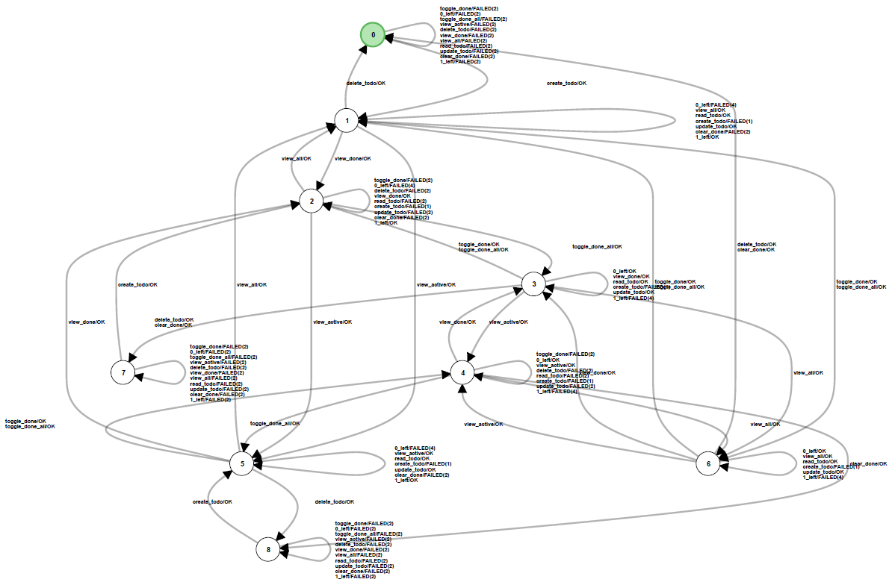

# Learning TodoMVC

In this section, we present all the necessary files and steps in order to learn the majority of all stable implementation of the [TodoMVC](http://todomvc.com/) project.

The symbol sets that we used to learn implementation of TodoMVC can be downloaded from here: [todomvc-symbols.zip](../../../assets/files/todomvc-symbols.zip).
In most of the cases, the final hypothesis should look like this:

## Requirements

* A system with Node.js and NPM installed
* Global access to gulp `npm install -g gulp gulp-cli`
* The latest version of ALEX
* Version 1.3 of [TodoMVC](http://todomvc.com/)

## Instructions

### Start TodoMVC

1. In the folder of TodoMVC, execute `npm install` **once**
2. Execute `gulp serve`
3. Open *http://localhost:8080*

### Learn TodoMVC with ALEX

In the next steps, we assume that we learn the *AngularJS* implementation of TodoMVC. 
Of cause, you can learn any implementation as well.
Adjust the URL and the symbol sets accordingly.

#### Prepare ALEX

1. Start ALEX and login
2. In the left menu, click on the item *App settings* and setup the path to a webdriver executable (preferable chrome)
3. Hit the *Save* button

#### Setup a TodoMVC project

1. In the project overview, create a new project with the URL of a TodoMVC implementation as a base URL, e.g. *http://localhost:8080/examples/angularjs/* if you want to learn AngularJS
2. Click on the newly created project
3. In the left menu, under the group *Symbols*, click on the item *Import* to import an already given symbol set
4. Drop the *2016-09-19_TodoMVC_Angular.symbols.json* in the corresponding field
5. Select all symbols and click on *Import*

#### Learn TodoMVC

1. In the left menu, under the group *Learn*, click on the item *Setup*
2. Select all symbols except the one called *Reset*
3. Mark the symbol *Reset* as reset symbol
4. In the top right corner, click on the settings button
5. As equivalence oracle, select *Random Word*. We executed all experiments with the parameters (min=30, max=80, words=60, seed=42)
6. In the dialog, select the webdriver you have set up previously
7. Click on *Save*
8. Start the learning process and wait ...

*Note: On our setup with a Core i5 6600k, 16Gb RAM and an SSD the final hypothesis is computed after about one hour.
Depending on your learn setup, e.g. higher parameters for the equivalence oracle, or your pc hardware, the execution time of the learning process may vary.*