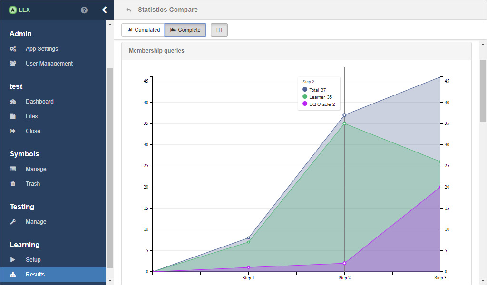

# Learning Experiment Analysis

Each learning process experiment and its results, including the models, statistics etc. are saved in the database. 
This section deals with possibilities to use the learned models for a further analysis.

## Comparing Hypotheses

- Adding models from other projects
- Adding models from a file

### Calculating Differences

- Separating word
- Difference graph

## Statistics

In ALEX, some statistics about the learning processes are gathered automatically, that are:

- The number of membership queries,
- the number of equivalence queries,
- the number of symbols that have been called and
- the execution time.

Each value is saved per learning step and separated by membership and equivalence oracle.

In order to display statistics, go to the results overview, and click on the item 1 on the corresponding result.

Now, you will see some bar charts for the cumulated values over all learning steps.
To see the statistics for each individual learning step, click on 2

A line chart then displays the values that are listed above for each step.

There is also the possibility to compare the statistics of multiple learning processes.
In this case, select all relevant results in the overview and click on 4.
The only difference here is that the displayed values are not separated by oracle.