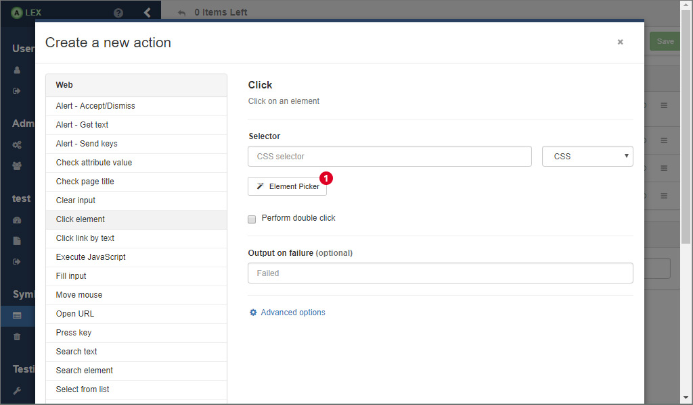
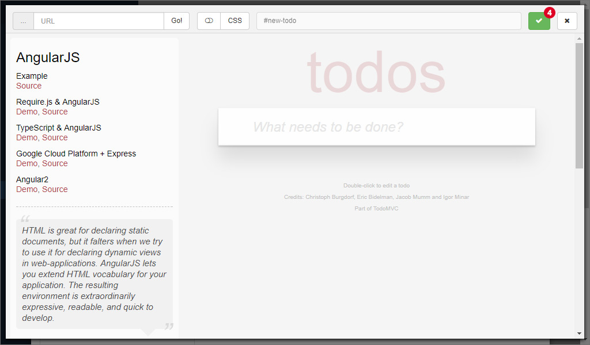
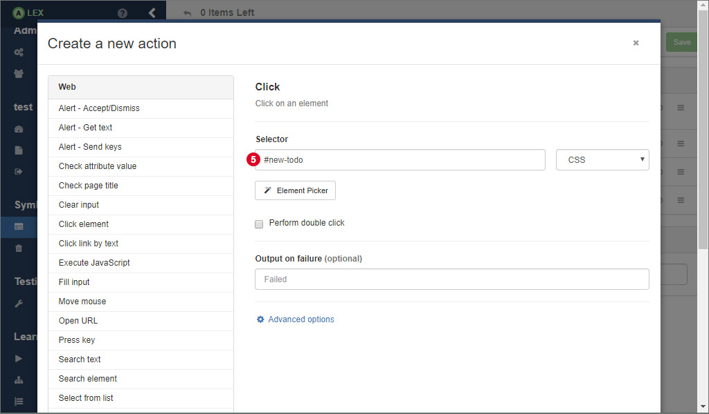
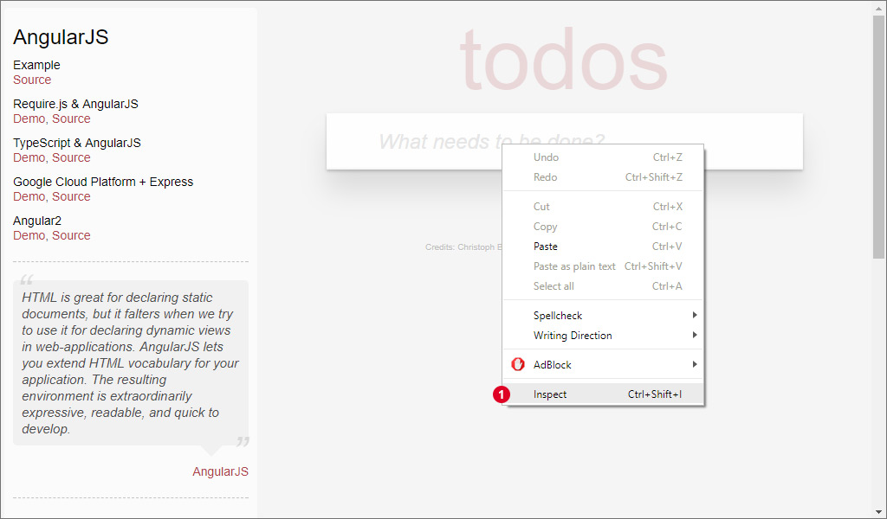
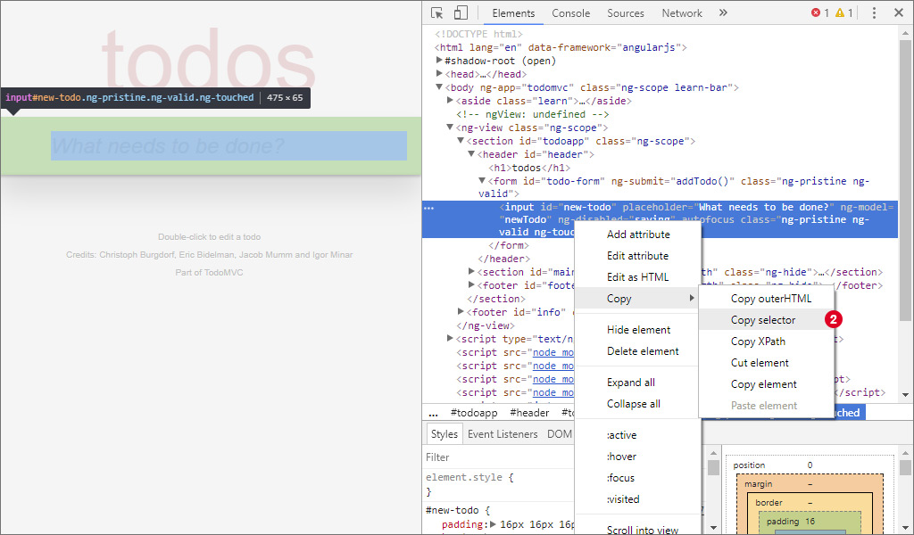

# Element Picker

For modeling actions that interact with the web browser, we need to specify the unique selector to the element we want to interact with.
A HTML document usually looks like this:

```html
<!DOCTYPE html>
<html>
<head>
</head>
<body>
  <div class="container">
    <a id="link" href="#">Link A</a>
    <a href="#">Link B</a>
  </div>
</body>
</html>
```

For example, the first link has an ID, so the selector would simply be `#link`.
The second link does not have an ID, so the selector corresponds to the path from the body (or a parent element with an ID) to that element.
Here, the selector for the second link would be `body > div:nth-child(1) > a:nth-child(2)` which reads as *the second direct child "a" node in the first direct child "div" node of the body*.

As you can imagine, websites are not necessarily structured that simple, and elements are nested deeply.
The deeper an element that has no ID is in the tree, the longer and therefore more complex the selector to that element might be.
Writing these selectors by hand is error prone and unnecessary hard.

Because of this, we offer a feature we call *Element Picker* which extracts the selector of an element automatically.



To use the element picker while creating an action, click on the corresponding button <span class="label">1</span>.


The element picker pops up and loads the web application that you specified in the project into an iframe.
Per default, you will get a message in the header that you see in the image above.
Normally, web browsers deny access to the structure of the website inside of an iframe due to security reasons.
In order to use the element picker as intended, follow the following instructions and restart the web browser:

| Browser | Instructions                                                                                                             |
|---------|--------------------------------------------------------------------------------------------------------------------------|
| Firefox | Install a plugin like [CORS Everywhere][cors-everywhere]                                                                 |
| Chrome  | Start chrome with disabled web security parameters: `--disable-web-security --user-data-dir` or install a similar plugin |


Finally, the element picker will look like above.
Start the selection by clicking on the button with the toggle icon <span class="label">2</span>.
The button on the right lets you switch between the CSS selector and an equivalent XPath expression.


Select an element by moving your mouse over the target element, which is highlighted with a big, red border <span class="label">3</span>.
In the header, the selector to the element is displayed.
If you are satisfied with the selection, just click on the element.



Finally, accept your selection by clicking on <span class="label">4</span> or start over.



The selector, and in some cases other data is automatically inserted into the corresponding input field <span class="label">5</span> of the action.

[cors-everywhere]: https://addons.mozilla.org/de/firefox/addon/cors-everywhere/


## Selecting Elements in the Browser

If you encounter issues with the element picker, you can also use your favourite web browser to get the selectors of elements.
Here, the usage of **Google Chrome** for this is demonstrated, but the procedure can be transferred to other web browsers as well.



First, right click on the target element and click on *"Inspect"* <span class="label">1</span>.



This will open the developer tools of the web browser which displays the structure of the website and highlights the corresponding element in blue.
Perform a right click on the highlighted element and navigate to *"Copy > Copy selector"* <span class="label">2</span> or *"Copy XPath"*.
The unique selector to the element is copied into the clipboard and can be pasted into the input field in ALEX.

<div class="alert alert-info">
    In Firefox, the extracted selector might not be unique, so use them with caution.
</div>